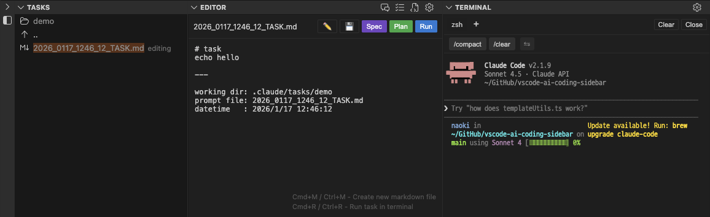

# AI Coding Panel

[](https://marketplace.visualstudio.com/items?itemName=nacn.ai-coding-sidebar) [](https://marketplace.visualstudio.com/items?itemName=nacn.ai-coding-sidebar) [](https://marketplace.visualstudio.com/items?itemName=nacn.ai-coding-sidebar)

A panel extension that strengthens integration with AI coding tools.

Streamline your AI-assisted coding workflow by managing prompt files, running AI commands, and viewing results—all within a single panel. No more switching between file explorer, editor, and terminal. Focus on coding while AI does the heavy lifting.



## Features

| Feature | Description |
| --- | --- |
| **Tasks** | Browse and manage files in a flat list view with directory navigation |
| **Editor** | Edit Markdown files directly in the panel with Run button integration |
| **Terminal** | Embedded terminal with multiple tabs and PTY support |
| **Menu** | Quick access to settings and common operations |

## Feature Details

### Tasks

Display directories and files under a specified path in a flat list view.

| Feature | Description |
| --- | --- |
| Flat list display | Shows contents of the current directory only (not a tree structure) |
| Directory navigation | Click a directory to navigate into it. Use ".." to go back to the parent directory |
| Auto-file selection | Automatically selects and displays the oldest TASK.md, PROMPT.md, or SPEC.md file when navigating to a directory |
| Path display | Current path shown as the first item in the list with inline action buttons (New PROMPT.md, New TASK.md, New SPEC.md, Copy, Rename, New Directory, Archive) |
| Sorting | Files are sorted by creation date (ascending) by default |
| Drag & Drop | Copy files by dragging them within the view or from external sources |
| Auto-refresh | Automatically updates when files are created, modified, or deleted |
| Settings icon | Quick access to default path and sort configuration |

### Editor

Edit Markdown files directly in the panel.

| Feature | Description |
| --- | --- |
| Auto-display | Automatically opens when selecting a timestamp-named Markdown file (format: `YYYY_MMDD_HHMM_SS_PROMPT.md`). Other Markdown files open in the standard editor |
| Save button | Displays in header with color change indicating unsaved changes. Creates new file if none is open (saves to current Tasks directory) |
| Run task | Press `Cmd+R` / `Ctrl+R` to send a customizable command to terminal (auto-saves before running, works even without a file open) |
| New file buttons | Create PROMPT.md, TASK.md, or SPEC.md files from the header. Also available with `Cmd+M` / `Ctrl+M` for PROMPT.md |
| Customizable run command | Configure the command executed by the Run button in settings |
| Run without file | Execute commands using editor content when no file is open |
| Terminal View integration | Run commands are sent to the embedded Terminal view |
| Read-only mode | Automatically switches to read-only mode when the file is active in VSCode editor |
| Auto-save | Automatically saves when switching files, navigating directories, or closing the view |
| Restore editing | Restores the editing file when returning from another extension |
| Settings icon | Quick access to run command configuration |
| Focus indicator | Shows a border around the view when focused |

### Terminal

Embedded terminal in the panel using xterm.js with full PTY support.

| Feature | Description |
| --- | --- |
| Multiple tabs | Create up to 5 terminal tabs, each with its own independent session. Click the "+" button to add a new tab, click a tab to switch. Close button (× Close) is located at the right end of the shortcut area |
| Session persistence | Terminal session and output history are preserved when switching views or extensions |
| Auto-scroll | Automatically maintains scroll position at the bottom when new output arrives or when view is resized (only if already at the bottom) |
| Clickable links | URLs open in browser, file paths (e.g., `./src/file.ts:123`) open in editor with line navigation |
| Unicode support | Full support for CJK characters and other Unicode characters with proper width calculation |
| Claude Code shortcuts | Quick command buttons for Claude Code: `claude`, `claude -c`, `claude -r` when not running; `/compact`, `/clear` when running |
| Auto-detect Claude Code | Automatically detects Claude Code start/exit from terminal output and switches shortcut buttons (works even when launched without using shortcut buttons) |
| Smart Enter key | Sends Enter key with shell commands but omits it for Claude Code commands (prevents unwanted newlines) |
| Configurable | Customize shell path, font size, font family, cursor style, cursor blink, and scrollback lines |
| WebView header | Tab bar with shell names, shortcut buttons, plus Clear and Kill buttons for the active tab |
| Settings icon | Quick access to terminal settings in the title bar |
| Default visibility | Collapsed (expand when needed) |
| Focus indicator | Shows a border around the view when focused |

### Menu

Quick access to settings and common operations.

| Feature | Description |
| --- | --- |
| Settings | Open user or global settings |
| Templates | Customize templates |
| Quick shortcuts | Open terminal, Checkout default branch, Git pull, Duplicate workspace in new window |

## Usage

### Keyboard Shortcuts

| Shortcut | Action |
| --- | --- |
| `Cmd+Shift+A` (macOS)<br>`Ctrl+Shift+A` (Windows/Linux) | Focus AI Coding Panel |
| `Cmd+S` (macOS)<br>`Ctrl+S` (Windows/Linux) | New Task (when panel is focused) |
| `Cmd+M` (macOS)<br>`Ctrl+M` (Windows/Linux) | Create new Markdown file (when panel is focused) |
| `Cmd+R` (macOS)<br>`Ctrl+R` (Windows/Linux) | Run task in Editor (auto-saves and sends command to terminal) |

### Basic actions
1. Click the "AI Coding Panel" icon in the activity bar (or press `Cmd+Shift+A` / `Ctrl+Shift+A`).
2. Use Tasks to create the folder you use for AI coding.
3. Create Markdown files from the Tasks view.
4. Click a timestamp-named Markdown file (e.g., `2025_1229_1430_25_PROMPT.md`) in Tasks to edit it in the Editor view below. Other Markdown files open in the standard editor.
5. Write instructions for the AI in the Editor and save with the Save button.
6. Right-click the Markdown file in Tasks and choose "Copy Relative Path," then share it with your AI tool.

## Template Feature

When you create a file from Tasks, you can automatically populate it with a template. This keeps Markdown files used for AI coding consistent and saves time.

### Configure the template
1. Click the gear icon in the Tasks pane.
2. Choose "Workspace Settings" -> "Customize template."
3. Template files are created in `.vscode/ai-coding-panel/templates/`:
   - `task.md` - Template for Start Task
   - `spec.md` - Template for New Spec
   - `prompt.md` - Template for New File (PROMPT.md)
4. Edit the templates and save them.

### Default template
The first template contains the following:

```markdown
file: {{filename}}
created: {{datetime}}

---

# task

```

### Available variables
Use the following variables inside a template:

- `{{datetime}}`: Creation date and time (for example, 2025/11/3 12:27:13)
- `{{filename}}`: Filename including extension (for example, 2025_1229_1430_25_PROMPT.md)
- `{{timestamp}}`: Timestamp (for example, 2025_1229_1430_25)
- `{{filepath}}`: File path relative to workspace root (for example, .claude/tasks/2025_1229_1430_25_PROMPT.md)
- `{{dirpath}}`: Directory path relative to workspace root (for example, .claude/tasks)

### Template priority
1. Workspace templates in `.vscode/ai-coding-panel/templates/` (if present)
2. Built-in extension templates

### Template examples
- Capture prompts for AI assistants in the `overview` section.
- Track to-dos in the `tasks` section.
- Add project-specific sections.

## File Operations

| Feature | Description |
| --- | --- |
| Create files or folders | Quickly scaffold new files and folders. |
| Rename | Rename files and folders. After renaming a directory, automatically navigates to the renamed directory. |
| Delete | Delete files and folders (moved to trash). |
| Copy / Cut / Paste | Perform standard clipboard operations. |
| Drag & Drop | Copy files by dragging them within the Tasks view or from external sources. Displays a success message after copying. |
| Archive | Archive task directories to keep your workspace organized. Click the archive icon (inline button) on a directory row, or right-click and select "Archive" to move it to the `archived` folder. When inside a non-root directory, an archive button also appears in the path display header - clicking it archives the current directory and returns to root. If a directory with the same name already exists, a timestamp is automatically added to avoid conflicts. |
| Checkout Branch | Right-click a directory to checkout a git branch using the directory name. Creates the branch if it doesn't exist, or switches to it if it already exists. |
| Insert Path to Editor | Insert relative path into the Editor view. Click the edit icon on file rows, or right-click and select "Insert Path to Editor". Supports multiple selection. |
| Insert Path to Terminal | Insert relative path into the Terminal view. Click the terminal icon on file rows, or right-click and select "Insert Path to Terminal". Supports multiple selection. Paths are separated by spaces. |

## Other Features

### Create Files and Folders

| Item | Steps |
| --- | --- |
| New Task | Click the rocket icon in Tasks title menu.<br>Creates a new directory under the currently opened directory in Tasks View and automatically generates a timestamped Markdown file.<br>The file is selected in Tasks with "editing" label and opens in Editor View.<br>If the current path cannot be retrieved, it falls back to the default path. |
| New Directory | Click the folder icon in the path display row.<br>Creates a new directory under the currently opened directory (without creating a Markdown file). |
| Create PROMPT.md | Click the file icon in the path display row or Editor header.<br>A timestamped Markdown file is created (for example, `2025_1229_1430_25_PROMPT.md`) and opens in Editor View. |
| Create TASK.md | Click the TASK.md icon in the path display row or Editor header.<br>A timestamped TASK.md file is created and opens in Editor View. |
| Create SPEC.md | Click the SPEC.md icon in the path display row or Editor header.<br>A timestamped SPEC.md file is created and opens in Editor View. |

### Configure the Default Relative Path

| Method | Steps |
| --- | --- |
| Plans settings (recommended) | 1. Click the gear icon in Plans.<br>2. The settings view opens with `aiCodingSidebar.plans.defaultRelativePath` pre-filtered.<br>3. Edit the default relative path (for example, `src`, `.claude`, `docs/api`). |
| Workspace settings | 1. Click the gear icon in Plans.<br>2. Select "Workspace Settings."<br>3. Choose one of the following:<br>&nbsp;&nbsp;- **Create/Edit settings.json**: Generate or edit the workspace settings file.<br>&nbsp;&nbsp;- **Configure .claude folder**: Create a `.claude` folder and apply settings.<br>&nbsp;&nbsp;- **Customize template**: Edit the template used when creating files. |
| Inline from the extension | 1. Click the edit icon in Plans.<br>2. Enter a relative path (for example, `src`, `.claude`, `docs/api`).<br>3. Choose whether to save it to settings. |

#### Relative path examples
- `src` -> `<project>/src`
- `docs/api` -> `<project>/docs/api`
- `.claude` -> `<project>/.claude`
- empty string -> workspace root

#### When the configured path doesn't exist
If the default relative path doesn't exist, Tasks displays a "Create directory" button. Click it to automatically create the directory and display its contents.

### Other

| Feature | Description |
| --- | --- |
| Copy relative path | Copy the workspace-relative path to the clipboard. |
| Plans settings | Open the settings view from Plans to edit the default relative path directly. |
| Search | Search files across the workspace. |

## Settings

| Setting | Description | Type | Default | Options / Examples |
| --- | --- | --- | --- | --- |
| `defaultRelativePath` | Default relative path for Tasks | string | `".claude/tasks"` | `"src"`, `.claude`, `"docs/api"` |
| `tasks.sortBy` | Sort files and directories in Tasks by | string | `"created"` | `"name"` (file name)<br>`"created"` (creation date)<br>`"modified"` (modified date) |
| `tasks.sortOrder` | Sort order for files and directories in Tasks | string | `"ascending"` | `"ascending"` (ascending)<br>`"descending"` (descending) |
| `editor.runCommand` | Command template to execute when clicking the Run button in the Editor view | string | `claude "${filePath}"` | Use `${filePath}` as placeholder for the file path |
| `editor.runCommandWithoutFile` | Command template to execute when clicking the Run button without a file open | string | `claude "${editorContent}"` | Use `${editorContent}` as placeholder for the editor content |
| `terminal.shell` | Shell executable path for Terminal view | string | `""` | Leave empty to use system default shell |
| `terminal.fontSize` | Font size for Terminal view | number | `12` | Any positive number |
| `terminal.fontFamily` | Font family for Terminal view | string | `"monospace"` | Any valid font family |
| `terminal.cursorStyle` | Cursor style for Terminal view | string | `"block"` | `"block"`, `"underline"`, `"bar"` |
| `terminal.cursorBlink` | Enable cursor blinking in Terminal view | boolean | `true` | `true` or `false` |
| `terminal.scrollback` | Number of scrollback lines in Terminal view | number | `1000` | Any positive number |

### Example configuration

Add the following to `.vscode/settings.json`:

```json
{
  "aiCodingSidebar.defaultRelativePath": ".claude",
  "aiCodingSidebar.tasks.sortBy": "created",
  "aiCodingSidebar.tasks.sortOrder": "ascending",
  "aiCodingSidebar.editor.runCommand": "claude \"Review the file at ${filePath}\"",
  "aiCodingSidebar.editor.runCommandWithoutFile": "claude \"${editorContent}\"",
  "aiCodingSidebar.terminal.fontSize": 12,
  "aiCodingSidebar.terminal.cursorStyle": "block"
}
```

## Development & Build

```bash
# Install dependencies
npm install

# Compile TypeScript
npm run compile

# Recompile automatically during development
npm run watch
```

## Debugging

### Prepare
1. Install dependencies: `npm install`
2. Compile TypeScript: `npm run compile`

### Start debugging

#### From the Command Palette (recommended)
1. Press `Ctrl+Shift+P` (Windows/Linux) or `Cmd+Shift+P` (Mac) to open the Command Palette.
2. Type and select "Debug: Start Debugging."
3. Press Enter to launch.

#### Other ways to launch
- **F5**: Start debugging immediately.
- **Run and Debug view**: Open the Run and Debug icon in the sidebar, choose "Run Extension," then click the green play button.
- **Menu bar**: Select "Run" -> "Start Debugging."

### While debugging
- A new VS Code window (Extension Development Host) opens.
- The activity bar now shows the "AI Coding Panel" icon.
- Set breakpoints, inspect variables, and step through code.
- Press `Ctrl+R` / `Cmd+R` to reload the extension.

## Installation

### Method 1: Development mode (for testing)
1. Clone or download this repository.
2. Open it in VS Code.
3. Press `F5` to launch an Extension Development Host window.
4. Test the extension in the new VS Code instance.

### Method 2: Install from a VSIX package

#### Recommended: Use the latest release from GitHub
1. Download the latest VSIX file from the [GitHub Releases page](https://github.com/NaokiIshimura/vscode-panel/releases).
2. Install via command line:
   ```bash
   code --install-extension ai-coding-sidebar-0.8.32.vsix
   ```
3. Restart VS Code.

#### Use a local build
```bash
# Install directly from the releases directory
code --install-extension releases/ai-coding-sidebar-0.8.32.vsix
```

#### Build the package yourself
1. Install the VSCE tool:
   ```bash
   npm install -g @vscode/vsce
   ```
2. Create a VSIX package:
   ```bash
   npm run package
   ```
3. Install the generated VSIX file:
   ```bash
   code --install-extension releases/ai-coding-sidebar-0.8.32.vsix
   ```
4. Restart VS Code.

## Automated Build & Release

This project uses GitHub Actions to build and release the extension.

### How the automated build works
- **Trigger**: Push to the `master` branch.
- **Build steps**:
  1. Compile TypeScript.
  2. Create the VSIX package automatically.
  3. Upload the package to GitHub Releases.
  4. Update the `releases/` directory in the repository.

### Versioning
Release tags are created based on the `version` field in `package.json`.

```bash
# Bump versions
npm run version:patch   # 0.0.1 -> 0.0.2
npm run version:minor   # 0.0.1 -> 0.1.0
npm run version:major   # 0.0.1 -> 1.0.0
```

## Uninstall

### Via command line
```bash
code --uninstall-extension ai-coding-sidebar
```

### Inside VS Code
1. Open the Extensions view (`Ctrl+Shift+X` / `Cmd+Shift+X`).
2. Search for "AI Coding Panel."
3. Click "Uninstall."

## Requirements

- VS Code 1.74.0 or later
- Node.js (development only)
